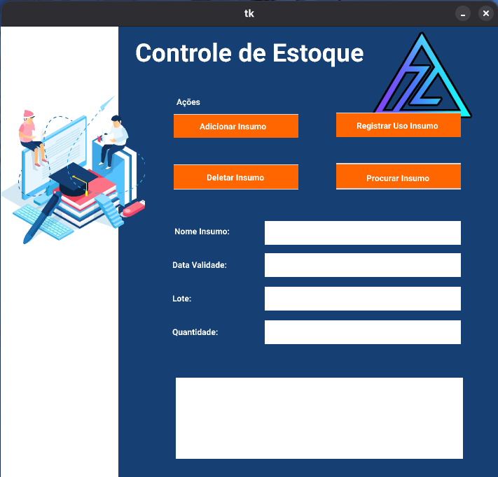
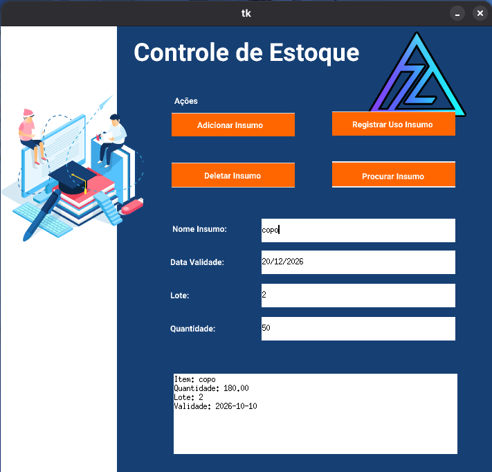
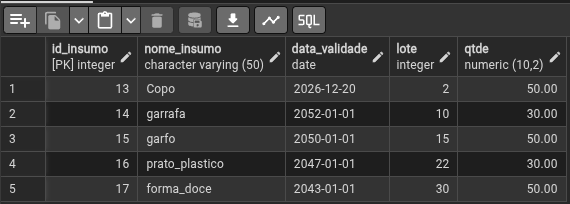
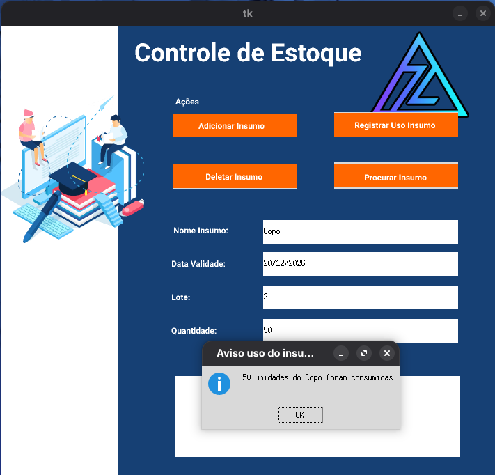
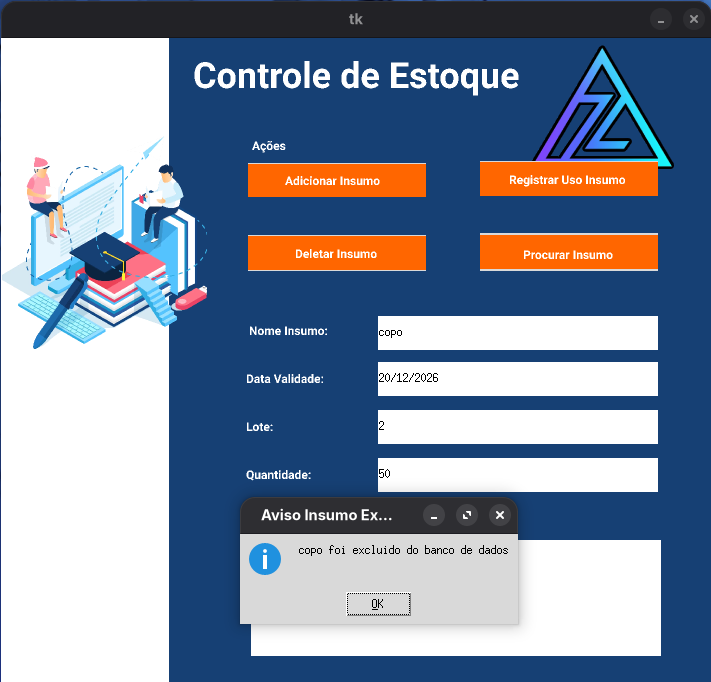
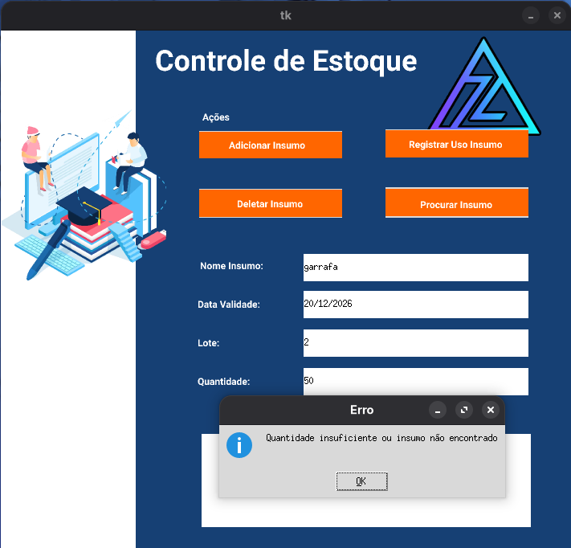
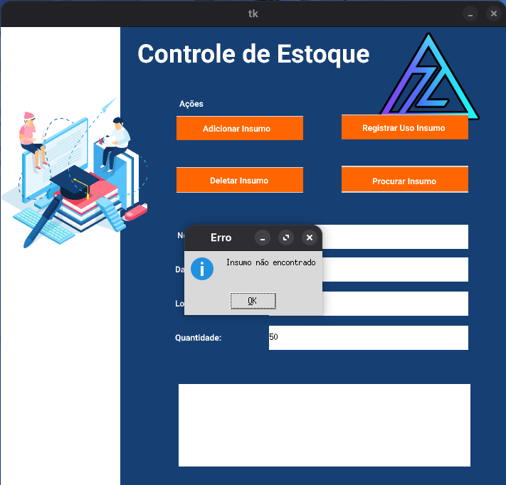
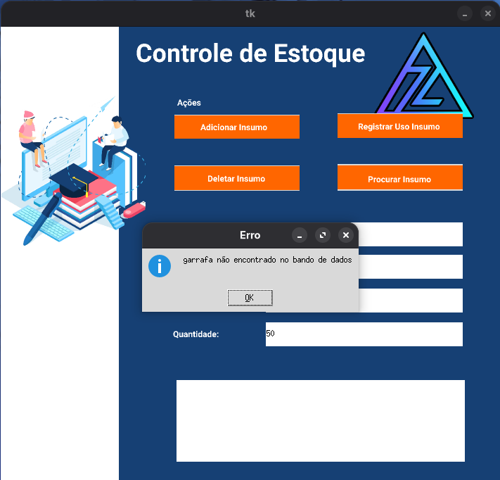

# StockPilot

Desktop inventory management system developed with **Python**, **Tkinter**, and **PostgreSQL**.

StockPilot is a desktop application designed to manage inventory items, allowing users to register products, search stock information, record consumption, delete items, and maintain data persistence through a PostgreSQL database.

The project was created to practice Python application development, database integration, SQL operations, and CRUD implementation with a graphical interface.

---

## 🚀 Features

* ✅ Register inventory items
* ✅ Search items by name
* ✅ Store inventory data in PostgreSQL
* ✅ Automatically update quantities when the same item and batch already exists
* ✅ Register item consumption
* ✅ Prevent negative stock quantities
* ✅ Delete inventory records
* ✅ Validate unavailable items and invalid operations
* ✅ Environment variable configuration for database credentials

---

## 🛠️ Technologies Used

* **Python 3**
* **Tkinter** - Desktop graphical interface
* **PostgreSQL** - Relational database
* **Psycopg** - PostgreSQL adapter for Python
* **python-dotenv** - Environment variables management
* **uv** - Python package and project management

---

## 🗄️ Database Structure

The application uses PostgreSQL to store inventory information.

Main table:

### `insumos`

| Column        | Type    |
| ------------- | ------- |
| id_insumo     | Integer |
| nome_insumo   | Varchar |
| data_validade | Date    |
| lote          | Integer |
| qtde          | Decimal |

The system uses database operations to control inventory quantities and maintain consistency between registered products and consumed items.

---

## 📷 Screenshots

### Application Interface



---

### Adding Inventory Items


---

### Searching Inventory Items



---

### Database Records



---

### Registering Item Consumption



---

### Deleting Inventory Items



---

## ⚠️ Error Handling

The application includes validation to prevent incorrect inventory operations.

### Trying to consume unavailable quantity



---

### Trying to delete a nonexistent item



---

### Searching for a nonexistent item



---

## 📂 Project Structure

```text
StockPilot/
│
├── app/
│   └── app.py                 # Main application
│
├── janela/                    # Tkinter interface assets
│   ├── background.png
│   ├── img0.png
│   ├── img1.png
│   ├── img2.png
│   └── img3.png
│
├── images/                    # Project screenshots
│   ├── adicionar_insumo.png
│   ├── banco_dados.png
│   ├── consumir_insumo.png
│   ├── delete_insumo.png
│   ├── erro_concumirinsumo.png
│   ├── erro_deleteinsumo.png
│   ├── erro_procurainsumo.png
│   ├── janela_pronta.png
│   └── procurar_insumo.png
│
├── .gitignore
├── .python-version
├── LICENSE
├── pyproject.toml
├── uv.lock
└── README.md
```

---

## ⚙️ Installation and Setup

### Clone the repository

```bash
git clone https://github.com/ZeniteOps/StockPilot.git
```

### Access the project folder

```bash
cd StockPilot
```

### Install dependencies

This project uses **uv** for dependency management:

```bash
uv sync
```

---

## 🔐 Environment Configuration

Create a `.env` file in the project root:

```env
DB_HOST=localhost
DB_PORT=5432
DB_NAME=your_database_name
DB_USER=your_database_user
DB_PASSWORD=your_database_password
```

The `.env` file should not be committed to the repository.

---

## ▶️ Running the Application

Start the application using:

```bash
uv run app/app.py
```

---

## 🔒 Security

Database credentials are stored using environment variables to avoid exposing sensitive information in the source code.

---

## 📄 License

This project is licensed under the MIT License.

---

## 👨‍💻 Author

Developed by **Matheus Giuliano**

GitHub:
https://github.com/ZeniteOps

Linkedin:
https://www.linkedin.com/in/magiuliano
